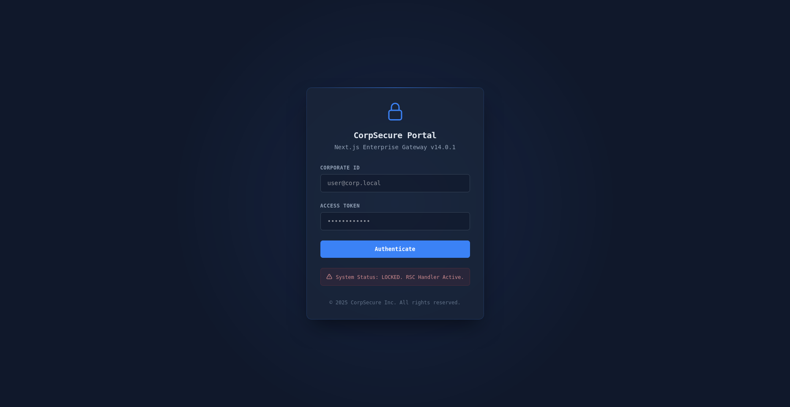
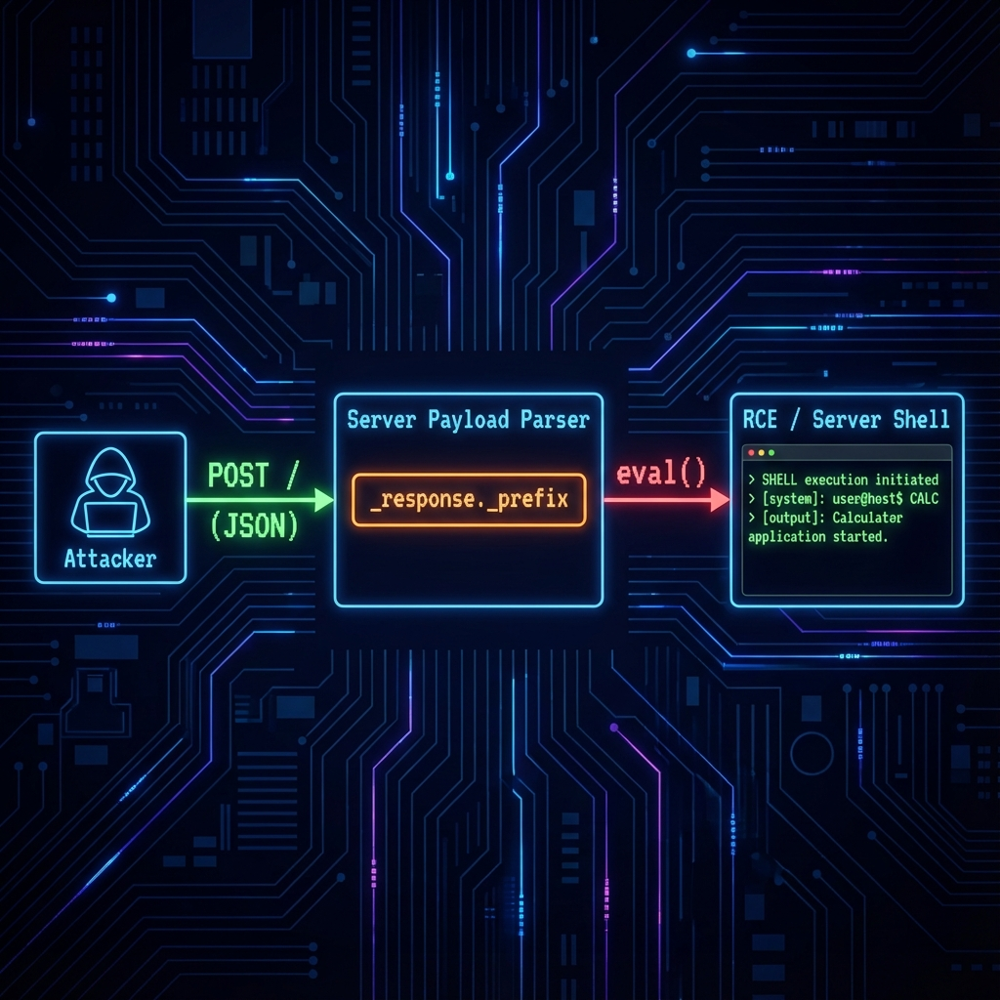

# 🛡️ React2Shell CTF 🚀




Welcome to **React2Shell-CTF**, a Dockerized environment designed to practice exploiting **React2Shell (CVE-2025-55182)**.

**React2Shell** is a critical vulnerability affecting React-based applications. This repository provides a safe, locally deployable Capture The Flag (CTF) challenge to help you understand and mitigate this flaw. **Can you pop a Reverse Shell?** 🐚

---

## ℹ️ Vulnerability Info

For a full technical explanation of **CVE-2025-55182**, please visit the official informational website:

### 👉 [react2shell.com](https://react2shell.com) 👈

---

## ⚠️ Disclaimer

> **IMPORTANT! READ BEFORE PROCEEDING**

This project is created **strictly for educational and learning purposes**.

*   🚫 **We do not condone or promote illegal activities.**
*   🎓 The goal is to provide a safe environment for developers and security professionals to understand how this vulnerability works.
*   🛡️ **The best way to protect oneself is by understanding the vulnerability.**

Using this material to attack targets without prior mutual consent is illegal.

---


### Solution & Walkthrough 📚
**Stuck?** Check out the step-by-step guides (now with Native Node.js Payload!):
*   📄 **[English Guide (WALKTHROUGH_EN.md)](./WALKTHROUGH_EN.md)**
*   📄 **[Guía en Español (WALKTHROUGH_ES.md)](./WALKTHROUGH_ES.md)**

---

## 🔍 How the Exploit Works
The vulnerability (CVE-2025-55182) exists in how the React Server Components deserializer handles specific object properties.



1.  **Injection**: The attacker sends a malicious JSON payload via a Multipart `POST` request.
2.  **Deserialization**: The server parses the JSON.
3.  **Property Gadget**: The `_response._prefix` property is mistrusted by the server. Instead of treating it as data, the server **evaluates** it as code.
4.  **RCE**: This `eval()` allows arbitary Javascript execution, leading to Remote Code Execution (RCE) and full system compromise.

---

## �️ Local Installation

### Prerequisites
*   Docker & Docker Compose

### Launch
```bash
git clone https://github.com/yz9yt/React2Shell-CTF.git
cd React2Shell-CTF
sudo docker-compose up --build
```
> **Note**: Use `--build` to ensure `netcat` is installed for the Reverse Shell challenge!

The challenge will be available at: **http://localhost:5555**

### 🎯 The Challenge
1.  Analyze the `server.js` code.
2.  Craft a payload to execute code.
3.  **Bonus**: Can you pop a **Reverse Shell**? 🐚

---
Happy Hacking! 🕵️‍♂️

---
Created by **[@yz9yt](https://x.com/yz9yt)** 🐦
